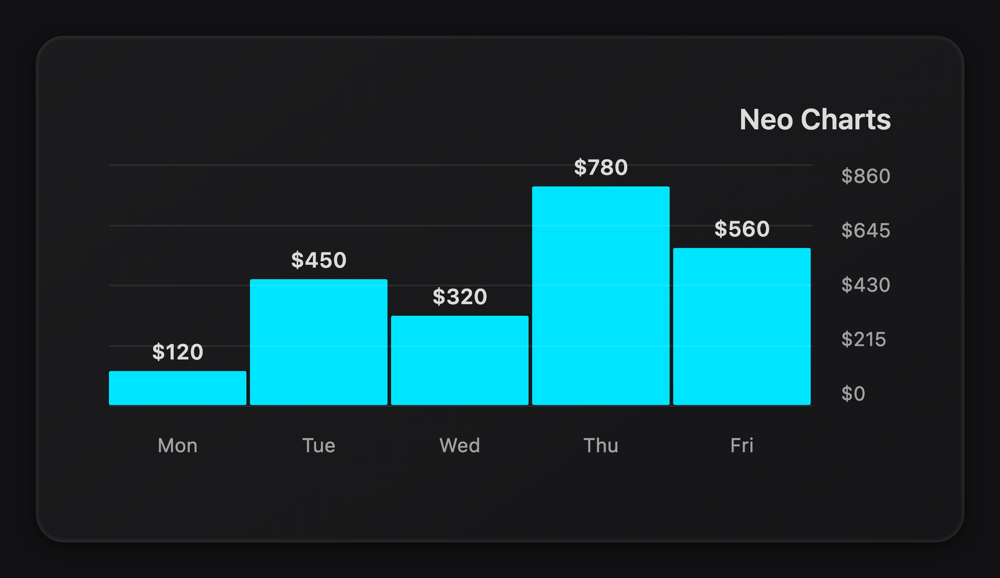
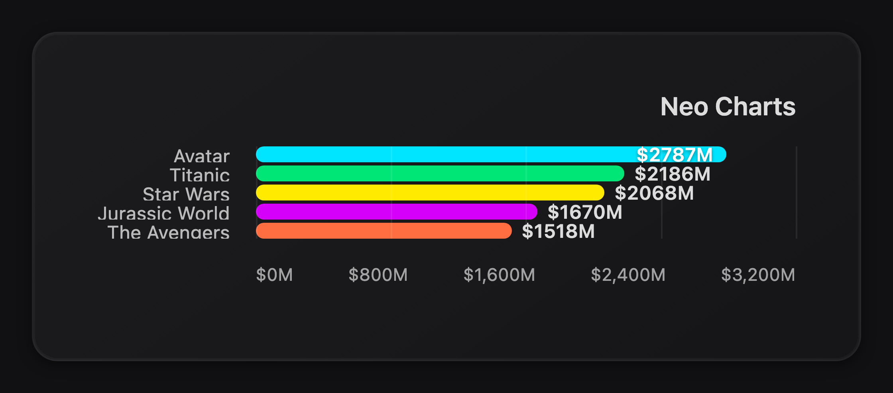
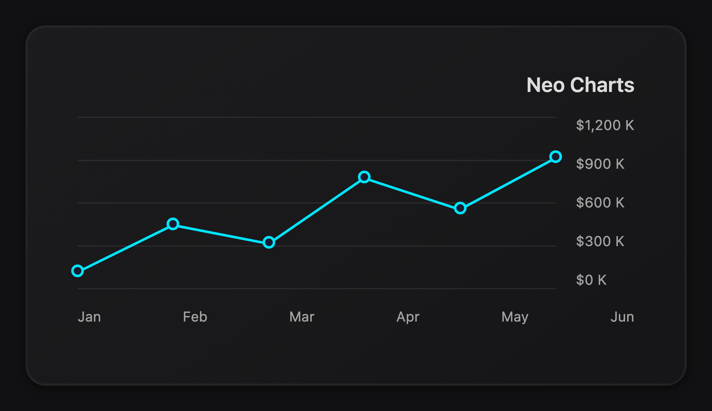
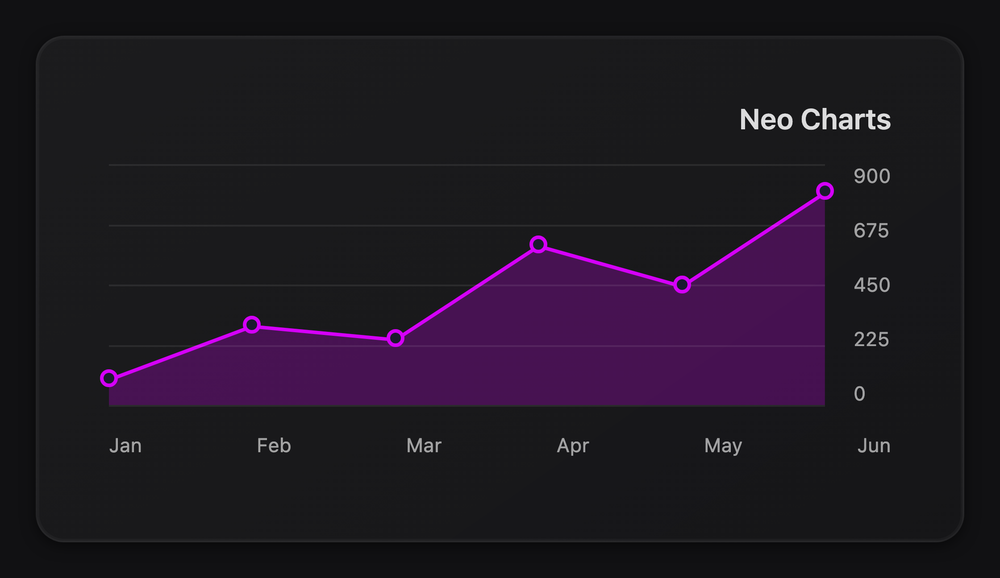
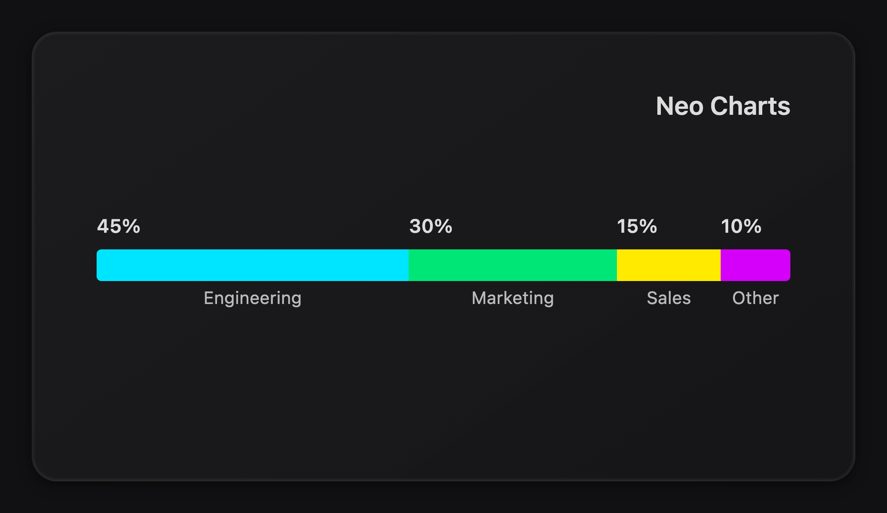
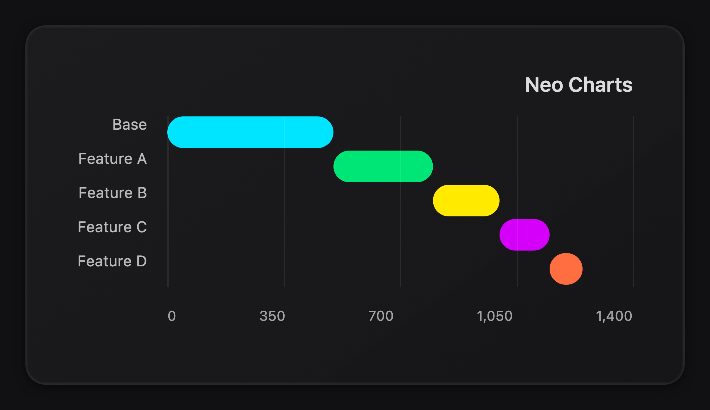
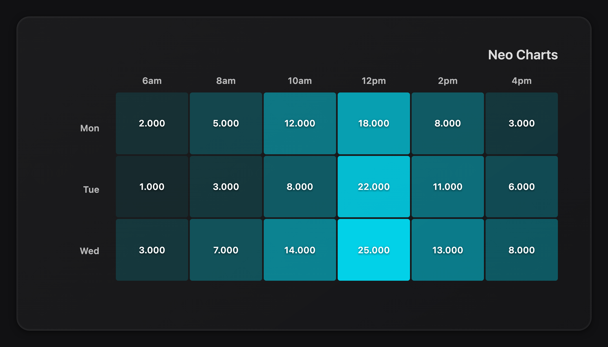
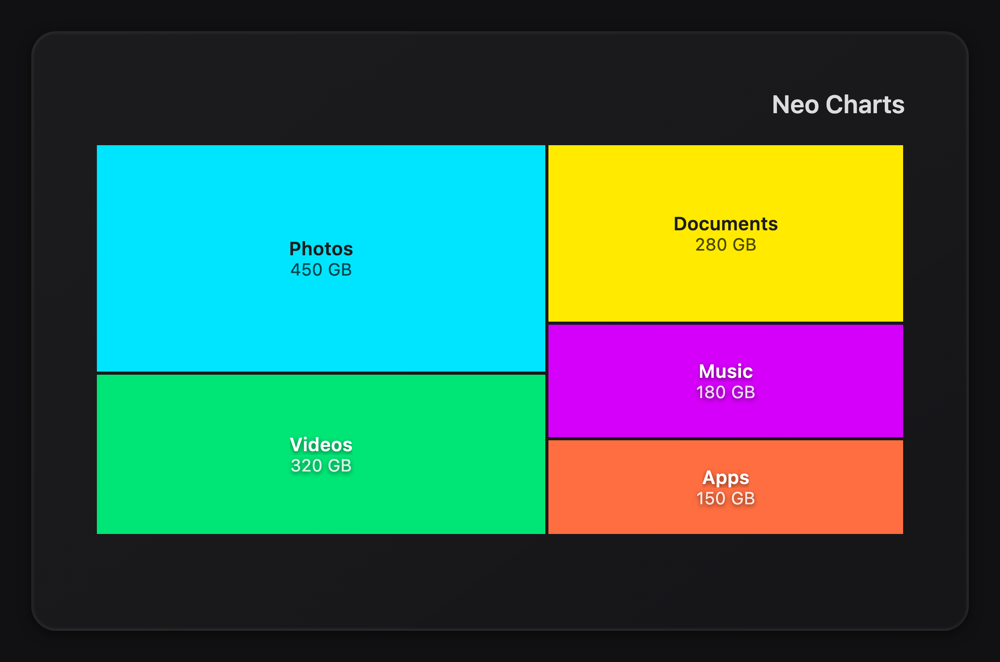
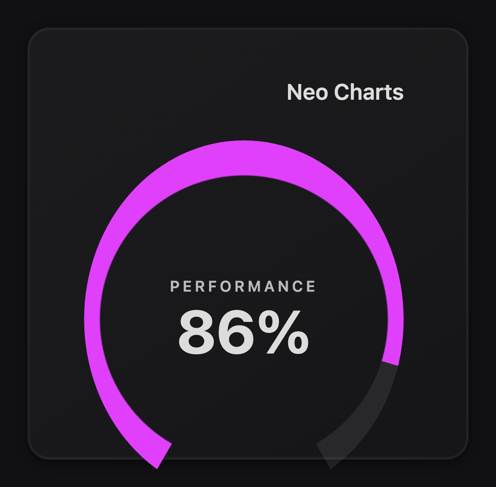

# Neo Charts

Lightweight HTML/CSS chart library with zero dependencies. No SVG, no Canvas — pure DOM elements styled with CSS.

## Features

- **Zero dependencies** — no jQuery, no D3, no build step required
- **Pure CSS rendering** — all chart elements are styled DOM nodes, no SVG or Canvas
- **Responsive** — charts resize with their container via ResizeObserver
- **Pixel-perfect** — integer pixel sizing with remainder distribution for crisp rendering
- **Animated** — entry animations and smooth hover transitions
- **Interactive** — tooltips on hover, highlight mode with bidirectional label sync (bar/waterfall)
- **Configurable** — gap between items, gauge thickness, default color palette, light/dark themes
- **12 chart types** — column, bar, line, area, progress, waterfall, heatmap, treemap, gauge, pie (with donut variant), bullet, funnel
- **Multi-series** — grouped and stacked modes for column and bar charts

## Installation

Download `neo-charts.js` and `neo-charts.css`, then include them in your HTML:

```html
<link rel="stylesheet" href="neo-charts.css">
<script src="neo-charts.js"></script>
```

Or install via npm:

```bash
npm install neo-charts
```

## Usage

Create a container element and call `neoCharts()` with a CSS selector (or DOM element) and an options object:

```html
<div class="my-chart"></div>

<script>
var chart = neoCharts('.my-chart', {
    title: { text: 'Revenue', align: 'center' },
    type: 'column',
    layout: { width: '100%', height: '250px' },
    data: {
        series: [{
            title: 'Quarterly',
            values: [100, 200, 150, 300],
            labels: ['Q1', 'Q2', 'Q3', 'Q4'],
            color: ['#00e5ff'],
            prefix: '$',
            suffix: 'K'
        }]
    }
});
</script>
```

The function returns an API object with `update()` and `destroy()` methods:

```js
// Update chart with new data (merges with original options)
chart.update({
    data: {
        series: [{
            values: [400, 500, 600, 700]
        }]
    }
});

// Remove chart and clean up listeners
chart.destroy();
```

## Chart Types

### Column



Vertical bar chart. Supports stacked mode for multiple series.

```js
neoCharts('.chart', {
    type: 'column',
    layout: { width: '100%', height: '250px' },
    data: {
        series: [{
            title: 'Sales',
            values: [120, 450, 320, 780, 560],
            labels: ['Mon', 'Tue', 'Wed', 'Thu', 'Fri'],
            color: ['#00e5ff'],
            prefix: '$'
        }]
    }
});
```

### Bar



Horizontal bar chart. Supports stacked mode. Set `layout.height` to `'auto'` to size based on content.

```js
neoCharts('.chart', {
    type: 'bar',
    layout: { width: '100%', height: 'auto' },
    data: {
        series: [{
            title: 'Revenue',
            values: [2787, 2186, 2068, 1670, 1518],
            labels: ['Avatar', 'Titanic', 'Star Wars', 'Jurassic World', 'The Avengers'],
            color: ['#00e5ff', '#00e676', '#ffea00', '#d500f9', '#ff6e40'],
            prefix: '$',
            suffix: 'M'
        }]
    }
});
```

### Line



Line chart with interactive dots and tooltips.

```js
neoCharts('.chart', {
    type: 'line',
    highlight: true,
    layout: { width: '100%', height: '250px' },
    data: {
        series: [{
            title: 'Revenue',
            values: [120, 450, 320, 780, 560, 920],
            labels: ['Jan', 'Feb', 'Mar', 'Apr', 'May', 'Jun'],
            color: ['#00e5ff'],
            prefix: '$',
            suffix: ' K'
        }]
    }
});
```

### Area



Same as line chart but with a filled region below the line.

```js
neoCharts('.chart', {
    type: 'area',
    layout: { width: '100%', height: '250px' },
    data: {
        series: [{
            title: 'Users',
            values: [100, 300, 250, 600, 450, 800],
            labels: ['Jan', 'Feb', 'Mar', 'Apr', 'May', 'Jun'],
            color: ['#d500f9']
        }]
    }
});
```

### Progress



Horizontal stacked bar showing proportions of a whole.

```js
neoCharts('.chart', {
    type: 'progress',
    layout: { width: '100%', height: '250px' },
    data: {
        series: [{
            title: 'Budget',
            values: [45, 30, 15, 10],
            labels: ['Engineering', 'Marketing', 'Sales', 'Other'],
            color: ['#00e5ff', '#00e676', '#ffea00', '#d500f9'],
            suffix: '%'
        }]
    }
});
```

### Waterfall



Horizontal bars with cumulative offset, useful for showing sequential contributions.

```js
neoCharts('.chart', {
    type: 'waterfall',
    layout: { width: '100%' },
    data: {
        series: [{
            title: 'Impact',
            values: [500, 300, 200, 150, 100],
            labels: ['Base', 'Feature A', 'Feature B', 'Feature C', 'Feature D'],
            color: ['#00e5ff', '#00e676', '#ffea00', '#d500f9', '#ff6e40']
        }]
    }
});
```

### Heatmap



Grid-based chart where cell color intensity represents the value. Each series becomes a row, and labels become columns. Set `gap` (pixels) to control the spacing between cells.

```js
neoCharts('.chart', {
    type: 'heatmap',
    highlight: true,
    layout: { width: '100%', height: '350px' },
    data: {
        series: [
            { title: 'Mon', values: [2, 5, 12, 18, 8, 3], labels: ['6am', '8am', '10am', '12pm', '2pm', '4pm'], color: ['#00e5ff'] },
            { title: 'Tue', values: [1, 3, 8, 22, 11, 6], labels: ['6am', '8am', '10am', '12pm', '2pm', '4pm'], color: ['#00e5ff'] },
            { title: 'Wed', values: [3, 7, 14, 25, 13, 8], labels: ['6am', '8am', '10am', '12pm', '2pm', '4pm'], color: ['#00e5ff'] }
        ]
    }
});
```

### Treemap



Space-filling chart where rectangle size represents the value. Uses a squarified layout algorithm.

```js
neoCharts('.chart', {
    type: 'treemap',
    highlight: true,
    layout: { width: '100%', height: '350px' },
    data: {
        series: [{
            title: 'Disk Usage',
            values: [450, 320, 280, 180, 150],
            labels: ['Photos', 'Videos', 'Documents', 'Music', 'Apps'],
            outputValues: ['450 GB', '320 GB', '280 GB', '180 GB', '150 GB'],
            color: ['#00e5ff', '#00e676', '#ffea00', '#d500f9', '#ff6e40']
        }]
    }
});
```

### Gauge



Circular gauge with animated fill. Series values are `[current, min, max]`. Ring thickness and value font size are configurable via the `gauge` option.

```js
neoCharts('.chart', {
    type: 'gauge',
    gauge: { thickness: 12, valueFontSize: 44 },
    layout: { width: '280px', height: '280px' },
    data: {
        series: [{
            title: 'Performance',
            values: [86, 0, 100],
            labels: ['Current', 'Min', 'Max'],
            outputValues: ['86%'],
            color: ['#e040fb'],
            suffix: '%'
        }]
    }
});
```

### Pie / Donut

Circular chart divided into slices proportional to values. Uses conic-gradient for rendering. Supports hover highlighting and tooltips.

A **donut** is just a pie with a hole — set `pie.innerRadius` (a percentage, `0` = full pie). There is no separate `donut` type; for convenience `type: 'donut'` is accepted as an alias for `type: 'pie'` and defaults `innerRadius` to `60`.

In **donut** mode (`innerRadius > 0`) set `gap` (pixels) to add spacing between slices; the gap shows the chart background through and scales with the rendered radius. Set `gap: 0` for edge-to-edge slices. The gap is ignored on a full pie (`innerRadius: 0`).

```js
// Pie
neoCharts('.chart', {
    type: 'pie',
    layout: { width: '100%', height: '280px' },
    data: {
        series: [{
            title: 'Market Share',
            values: [40, 30, 20, 10],
            labels: ['Chrome', 'Safari', 'Firefox', 'Other'],
            color: ['#3b82f6', '#10b981', '#f59e0b', '#8b5cf6']
        }]
    }
});

// Donut — same chart, with a hole
neoCharts('.chart', {
    type: 'pie',
    pie: { innerRadius: 70 },
    layout: { width: '100%', height: '280px' },
    data: {
        series: [{
            title: 'Status',
            values: [78, 12, 10],
            labels: ['Passing', 'Failing', 'Pending'],
            color: ['#10b981', '#ef4444', '#6b7280'],
            suffix: '%'
        }]
    }
});
```

### Bullet

Horizontal bar chart with qualitative ranges and a target marker. Designed for comparing a measured value against a target. Set `bullet.targets` for comparative markers and `bullet.ranges` for background bands (absolute values).

```js
neoCharts('.chart', {
    type: 'bullet',
    bullet: {
        targets: [90, 85, 95],
        ranges: [60, 80, 100]
    },
    layout: { width: '100%', height: '200px' },
    data: {
        series: [{
            title: 'KPIs',
            values: [82, 71, 93],
            labels: ['Revenue', 'Profit', 'Satisfaction'],
            color: ['#3b82f6', '#f59e0b', '#10b981'],
            suffix: '%'
        }]
    }
});
```

### Funnel

Chart of decreasing-width trapezoids. Each level tapers into the next, representing conversion or drop-off stages. By default the flow runs top → bottom (widest stage on top).

Two layout options control orientation:

- **`funnel.direction`** — `'vertical'` (default) or `'horizontal'` (left → right flow).
- **`funnel.flip`** — `false` (default) or `true` to mirror the flow axis. Flipping a vertical funnel produces a **pyramid** (narrow top, wide base); flipping a horizontal funnel reverses it to right → left.

```js
neoCharts('.chart', {
    type: 'funnel',
    funnel: { direction: 'vertical', flip: false },
    layout: { width: '100%', height: '280px' },
    data: {
        series: [{
            title: 'Pipeline',
            values: [1200, 800, 400, 120],
            labels: ['Visitors', 'Leads', 'Opportunities', 'Deals'],
            color: ['#6b7280', '#3b82f6', '#f59e0b', '#10b981'],
            decimals: 0
        }]
    }
});

// Pyramid (wide base):  funnel: { flip: true }
// Horizontal funnel:     funnel: { direction: 'horizontal' }
```

## Options Reference

| Option | Type | Default | Description |
|---|---|---|---|
| `type` | string | `'column'` | Chart type: `column`, `bar`, `progress`, `waterfall`, `line`, `area`, `heatmap`, `treemap`, `gauge`, `pie`, `bullet`, `funnel`. (`donut` is accepted as an alias for `pie` with `innerRadius: 60`.) |
| `cssClass` | string | `''` | Additional CSS class on the chart container |
| `highlight` | boolean | `false` | Dim sibling items on hover (bidirectional for bar/waterfall labels) |
| `animate` | boolean | `true` | Animate items on initial render |
| `legend` | boolean | `true` | Show legend when applicable. Auto-hidden if it would occupy more than a third of the chart height. |
| `smooth` | boolean | `false` | Use smooth curves for line/area charts |
| `fit` | boolean | `false` | Fit chart to container |
| `gap` | number | `2` | Gap in pixels between chart items. Applies to `column`, `bar`, `treemap`, `heatmap`, and `donut` (spacing between slices; donut only — ignored on a full pie). |
| `theme` | string | `'dark'` | Color theme: `'dark'` or `'light'` |
| `gauge.thickness` | number | `14` | Gauge ring thickness in pixels |
| `gauge.valueFontSize` | number | `48` | Gauge value font size in pixels |
| `pie.innerRadius` | number | `0` | Inner radius as percentage (0 = full pie, 60+ = donut). Defaults to 60 when `type: 'donut'` is used |
| `bullet.targets` | array | `[]` | Target marker values per item (absolute values) |
| `bullet.ranges` | array | `[]` | Qualitative range boundaries (absolute values). Auto-generated if empty |
| `funnel.direction` | string | `'vertical'` | Funnel flow direction: `'vertical'` or `'horizontal'` |
| `funnel.flip` | boolean | `false` | Mirror the funnel's flow axis. Vertical + flip = pyramid (wide base); horizontal + flip = right → left |
| `title.text` | string | `'Neo Charts'` | Chart title text |
| `title.subtitle` | string | `''` | Subtitle text below the title |
| `title.align` | string | `'right'` | Title alignment: `left`, `center`, `right` |
| `layout.width` | string | `'100%'` | Chart width (CSS value) |
| `layout.height` | string | `'300px'` | Chart height (CSS value or `'auto'`) |
| `layout.lines.number` | number | `4` | Number of guideline lines |
| `layout.lines.align` | string | `'right'` | Guideline label position: `left`, `right` |
| `data.render.empty` | string | `'No data available.'` | Message shown when series has no data |
| `data.render.stacked` | boolean | `false` | Stack multiple series (column/bar) |
| `data.render.threshold` | array | `[]` | Threshold marker lines. Each entry is a data value (positioned against the auto axis) or a string percentage like `'75%'`. Drawn horizontally on column/line/area, vertically on bar/waterfall. |
| `data.series` | array | `[]` | Array of series objects |
| `onClick` | function | `null` | Callback when a chart item is clicked. Receives `(eventData, domEvent)` where `eventData` has `seriesIndex`, `index`, `value`, `label`, `seriesTitle`, `element`. Fires for all chart types including gauge (index 0 = current value). |
| `onHover` | function | `null` | Callback when a chart item is hovered. Same signature as `onClick`. |

### Series Object

| Property | Type | Description |
|---|---|---|
| `title` | string | Series name (shown in legend and tooltips) |
| `values` | number[] | Data values |
| `labels` | string[] | Label for each value |
| `outputValues` | string[] | Custom display values (e.g. `['1.2K', '3.4M']`). Falls back to raw values if empty. |
| `color` | string[] | One color for the whole series, or one per item. When omitted, a built-in 10-color palette is used automatically (cycled by item, or by series index for line/area). |
| `prefix` | string | Prepended to displayed values (e.g. `'$'`) |
| `suffix` | string | Appended to displayed values (e.g. `'%'`) |
| `decimals` | number | Decimal places in tooltips (default: `3`) |

### Default Color Palette

When no `color` array is provided, items cycle through this 10-color palette:

`#3b82f6` `#10b981` `#f59e0b` `#ef4444` `#8b5cf6` `#ec4899` `#06b6d4` `#f97316` `#6366f1` `#14b8a6`

## API

`neoCharts(selector, options)` returns:

| Method | Description |
|---|---|
| `chart.update(newOptions)` | Merge new options and re-render the chart. Returns a new API object. |
| `chart.destroy()` | Remove the chart and clean up event listeners. |
| `chart.element` | The DOM element containing the chart. |

## Notes

- **Non-negative chart types** — `pie`, `funnel`, and `treemap` are proportional and treat negative values as `0` (a console warning is emitted). Use `column`/`bar`/`line`/`area` for data that crosses zero.
- **Global alias** — `simpleChart` is exposed as a backward-compatible alias for `neoCharts` when loaded via a plain `<script>` tag.

## Demo

- [demo/demo1.html](demo/demo1.html) — full security dashboard (23 charts)

## License

MIT
